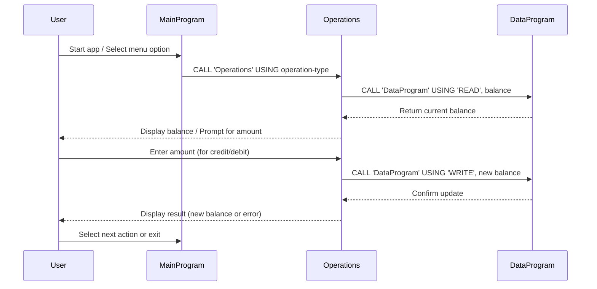

# COBOL Account Management System Documentation

This project is a simple COBOL-based Account Management System, designed to demonstrate basic account operations such as viewing balances, crediting, and debiting accounts. The system is structured for educational purposes and simulates business rules relevant to student accounts.

## Purpose of Each COBOL File

### `main.cob`
- **Purpose:** Entry point and main control flow of the application.
- **Key Functions:**
  - Presents a menu to the user for account operations.
  - Accepts user input and delegates actions to the `Operations` program.
  - Handles program exit and input validation.
- **Business Rules:**
  - Only allows menu choices 1-4; invalid choices prompt a warning.

### `operations.cob`
- **Purpose:** Implements the core business logic for account operations.
- **Key Functions:**
  - Handles viewing the current balance (`TOTAL`), crediting (`CREDIT`), and debiting (`DEBIT`) the account.
  - Interacts with `data.cob` to read and update the account balance.
  - Ensures that debit operations do not exceed the available balance.
- **Business Rules:**
  - Credit: Prompts for an amount, adds it to the balance, and updates storage.
  - Debit: Prompts for an amount, checks for sufficient funds, subtracts if possible, and updates storage. If insufficient funds, displays an error.

### `data.cob`
- **Purpose:** Manages persistent storage of the account balance.
- **Key Functions:**
  - Provides `READ` and `WRITE` operations for the account balance.
  - Stores the balance in a working-storage variable, simulating persistent data.
- **Business Rules:**
  - Only allows reading or writing the balance via explicit operation types.

## Specific Business Rules for Student Accounts
- The system assumes a single account (e.g., for a student) with an initial balance of 1000.00.
- All operations are performed on this single account.
- Debit operations are only allowed if the account has sufficient funds.
- Credit and debit amounts are entered by the user at runtime.

## Sequence Diagram: Data Flow

---
For further details, see the source code in `/src/cobol/`.
